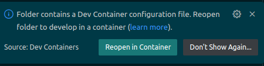
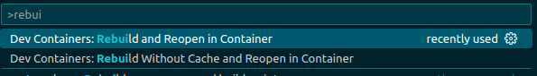
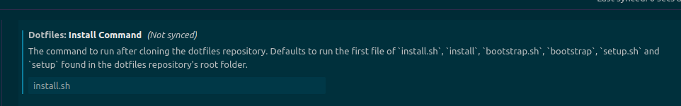
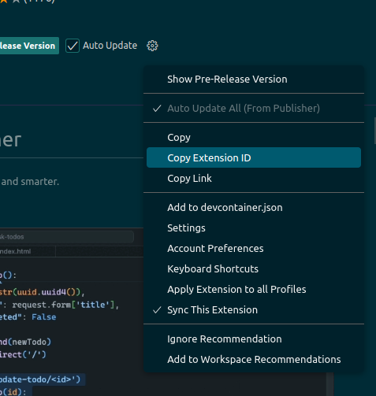

# DevContainer test repository


## INDEX

- [ABOUT](#about)
- [ENVIRONMENT](#environment)
- [PREPARING](#preparing)
- [HOW TO USE](#how-to-use)
- [Dev Containers Tips](#dev-containers-tips)

---

## ABOUT

Trying out the [Dev Containers](https://code.visualstudio.com/docs/devcontainers/containers) feature.

### What is the benefit of DevContainer

- Dev Containersを使うと，Docker Container内でVS Codeを開くことができ，コンテナ内のソースコードを直接編集できる
- Dev Containers起動時に設定ファイルに記載のあるVS CodeのExtensions等も一括でインストールできる --> チームで開発環境を統一しやすい
- Dockerfileやcompose.yamlを汚さずにツールのインストールや設定変更ができる

---

## ENVIRONMENT

- React with Vite
- nginx

---

## PREPARING

1. install Docker, [VS Code](https://code.visualstudio.com/)
2. clone this repository
3. install [Dev Containers](https://marketplace.visualstudio.com/items?itemName=ms-vscode-remote.remote-containers) VS Code Extensions

---

## HOW TO USE

### Dev Container

```shell
code ~/devcontainer-test
```

In VS Code, from the command palette, select `Reopen in Container`



> [!NOTE]
> To rebuild Dev Container，use `Rebuild and Reopen in Container` or `Rebuild without cache and Reopen in Container`.



> [!WARNING]
> When an error occurs during Dev Containers build, clearing the cache and rebuilding may solve the problem.
>
> ```shell
> docker rm $(docker ps -a -q)
> docker rmi $(docker images -q)
> docker builder prune
> ```

### deploy

deploy react app with nginx.

```shell
docker compose up
```

go to [http://localhost:80](http://localhost:80)

---

## Dev Containers Tips

Dev Containerを使うにあたってのtips等をまとめる。

### Multi Stage build使ってDev Containers用の環境を作る

基本的にコンテナにデプロイ時に不必要なものは含めたくないので，Multi Stage buildを使ってDev Containers用の環境を作ることが推奨される。

#### Dockerfileでtargetを指定

- **compose.yamlを使わず**，Dockerfile使う場合にはdevcontainer.jsonでtargetの指定ができる。

```Dockerfile
FROM mcr.microsoft.com/devcontainers/typescript-node:22-bookworm AS devcontainer # target名を指定する
```

- .devcontainer/devcontainer.jsonでtargetを指定する

  > A string that specifies a Docker image build target that should be passed when building a Dockerfile. Defaults to not set. For example: "build": { "target": "development" } [^1]

```json
{
  "name": "dev-container-test",
  "build": {
    "dockerfile": "Dockerfile",
    "target": "devcontainer"
  },
}
```

#### compose.yamlを使ってtargetを指定

compose.yamlを使う場合には`target`をcompose.yaml側で指定するためにDev Containers用に`.devcontainer/compose.yaml`を作成する必要がある。[^2]，[^3]

```yaml
# compose.yaml
services:
  react-app:
    build:
      target: devcontainer // targetを指定
      context: ./
      dockerfile: Dockerfile
    image: react-img-devcontainer:latest
    container_name: react-container-devcontainer
```

```Dockerfile
FROM mcr.microsoft.com/devcontainers/typescript-node:22-bookworm AS devcontainer # target名を指定する
```

> [!NOTE]
> compose.yamlの`services`名をdevcontainer.jsonの`service`に指定する。

```json
{
  "name": "dev-container-test", // 任意の名前
  "dockerComposeFile": [
    "../compose.yaml",
    "compose.yaml"
  ],
  "service": "react-app", // compose.yamlのサービス名
}
```

---

### Dev Containers用の公式イメージを使う

[Dev Containers公式イメージ](https://github.com/devcontainers/images/tree/main/src)がいくつかの言語ではサポートされている。

> [!NOTE]
>
> 例えば，[base-debian](https://github.com/devcontainers/images/blob/main/src/base-debian/.devcontainer/Dockerfile)は[builderpack-deps](https://hub.docker.com/_/buildpack-deps)をベースにして作成されている。
> builderpack-depsとは，ビルド時に必要なパッケージをまとめたイメージ。
> > A collection of common build dependencies used for installing various modules, e.g., gems.[^4]

---

### dotfilesをDev Containersに持ち込む

> [!NOTE]
> dotfilesは設定ファイルやスクリプト等をまとめたリポジトリのこと。
> e.g. .bashrc, .gitconfig, .vimrc, etc.

**VSCodeの個人用のsettings.json**に以下を参考に記載することでdotfilesをDev Containersに持ち込むことができる。[^5]

> [!NOTE]: .gitconfigは何もしなくてもDev ContainersのHOMEディレクトリにコピーされる。

```json
  // Dev Containersでdotfilesを使う。
  "dotfiles.repository": "https://github.com/RyosukeDTomita/dotfiles.git",  // fixme
  "dotfiles.targetPath": "~/dotfiles", // fixme
  "dotfiles.installCommand": "install.sh", // fixme ~/dotfilesのrepository topからみたスクリプトのパスを指定する。
```

> [!NOTE]
> `dotfiles.installCommand`には~/dotfilesのrepository topから見たスクリプトのパスを指定する。
> そのため，dotfilesのGitHub Repositoryにinstall.shは配置が必要。[自分のdotfilesのinstall.sh](https://github.com/RyosukeDTomita/dotfiles/blob/main/install.sh)

> [!NOTE]
> `dotfiles.installCommand`を指定しない場合にはデフォルトのファイル名として以下が存在すればdotfilesのinstallが実行されるとVS Codeの設定画面に記載がある。
>
> 

#### dotfiles TIPS

Dev Containerの環境では，`REMOTE_CONTAINERS=true`が環境変数に定義されており，これを使ってDev Containerかどうかを判別できるためローカル用とDev Containers用で処理を分けることができる。[dotfilesのinstall scriptでREMOTE_CONTAINERS=trueで分岐する例](https://qiita.com/sigma_devsecops/items/c40031fc05eeb0811410)

---

### VS Code ExtensionsをDev Containersに持ち込む

#### Extensionsの設定をどこに記載するか

- devcontainer.jsonと.vscode/settings.json両方に記載ができる。
- 基本は.vscode/settings.json配下に設定を記載するで良いと思っている。

#### Extensionsを追加する方法

Extension IDを.devcontainer/devcontainer.jsonに記載する。


```json
  "extensions": [
    "formulahendry.auto-rename-tag",
  ],
```

#### DevContainerに自分だけが使用するExtensionsを持ち込む

- **個人用のsettings.json**に記載することで，リポジトリの設定を変更せずにExtensionsを追加できる。

```json
  // Dev containersに個人的に使うExtensionsを入れる。
  "dev.containers.defaultExtensions": [
    "vscodevim.vim"
  ],
```

---

### portを開放する設定比較

devcontainer.jsonでportを開放する方法は3つある。

- `addPort`は非推奨。`forwardPorts`を使う方が良い。
  > In most cases, we recommend using the new forwardPorts property. [^6]
- `forwardPorts`を使うことで，コンテナのポートをローカルにフォワードすることができる。
- `portAttribute`を使うことで，portに説明をつけることができる。

---

### サービスをビルドなしで再起動可能にする

Dev Containersにはコンテナのイベントをトリガーしてコマンドを実行する機能がある。[^7]

```json
{
  "name": "dev-container-test",
  "dockerComposeFile": [
    "../compose.yaml",
    "compose.yaml"
  ],
  "service": "react-app",
  "workspaceFolder": "/app",
  "overrideCommand": true, // コンテナを起動Gしたままにする DockerfileのCMDで永続するコマンドを実行しているなら不要
  // rvest.vscode-prettier-eslintに使うパッケージをinstall
  "postCreateCommand": "yarn add -D prettier@^3.1.0 eslint@^8.52.0 prettier-eslint@^16.1.2 @typescript-eslint/parser@^5.0.1 typescript@^4.4.4",
  "postStartCommand": ["echo", "Hello, DevContainer"], // DevContainer起動時
  "postAttachCommand": ["echo", "Hello, DevContainer"], // DevContainerに既存コンテナをattach時
  "initializeCommand": ["echo", "Starting DevContainer..."], // DevContainerのビルド前，実行前にローカルで実行されるコマンド
```

#### installスクリプトを使う

必要そうなパッケージをまとめた[install-pkg.sh](./install-pkg.sh)を作成し，postCreateCommandで実行する。

---

### ディレクトリのマウント

- ファイル単体でのマウントはできないぽい。設定ファイルとかは前述のdotfilesを使って共有する。

```json
{
  "name": "dev-container-test",
  "dockerComposeFile": [
    "../compose.yaml",
    "compose.yaml"
  ],
  "service": "react-app",
  "workspaceFolder": "/app",
  "overrideCommand": true,
  "mounts": [
    "source=~/.aws,target=/home/root/.aws,type=bind" // ~/.awsをマウントできる
  ],
```

---

### References

[^1]: <https://containers.dev/implementors/json_reference/#general-properties>

[^2]: <https://github.com/microsoft/vscode-remote-release/issues/7810>

[^3]: <https://stackoverflow.com/questions/78421879/devcontainer-docker-compose-best-practice>

[^4]: <https://hub.docker.com/_/buildpack-deps>

[^5]: <https://code.visualstudio.com/docs/devcontainers/containers#_personalizing-with-dotfile-repositories>

[^6]: <https://containers.dev/implementors/json_reference/#image-specific>
<https://containers.dev/implementors/json_reference/#lifecycle-scripts>
